# luci-theme-proton2025

A dark LuCI theme for OpenWrt 23.05+ (ucode) with an optional light mode, a
built-in page search and theme settings inside the LuCI UI.


<div align="center">
  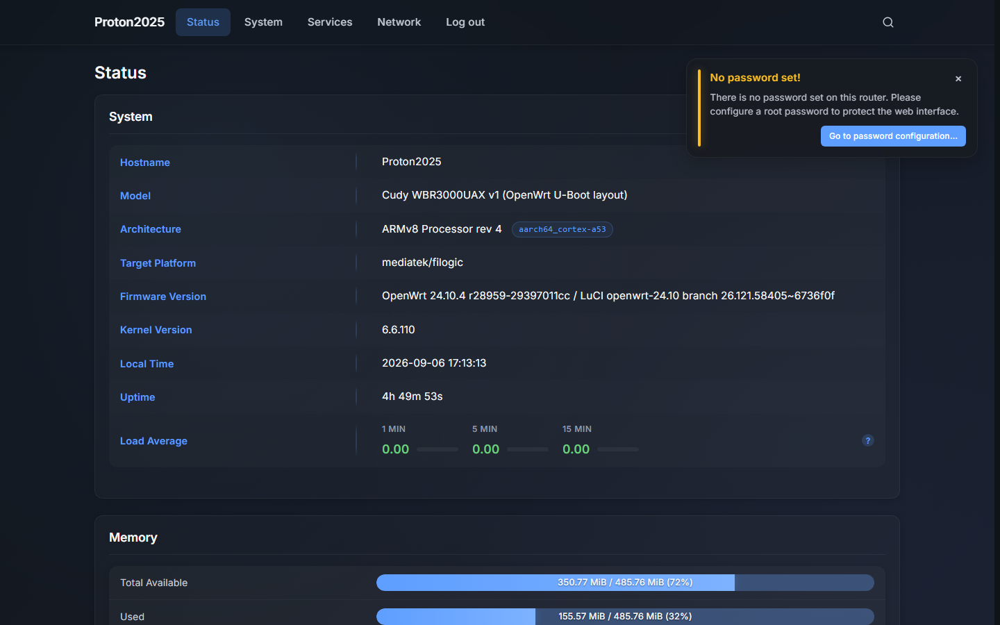
  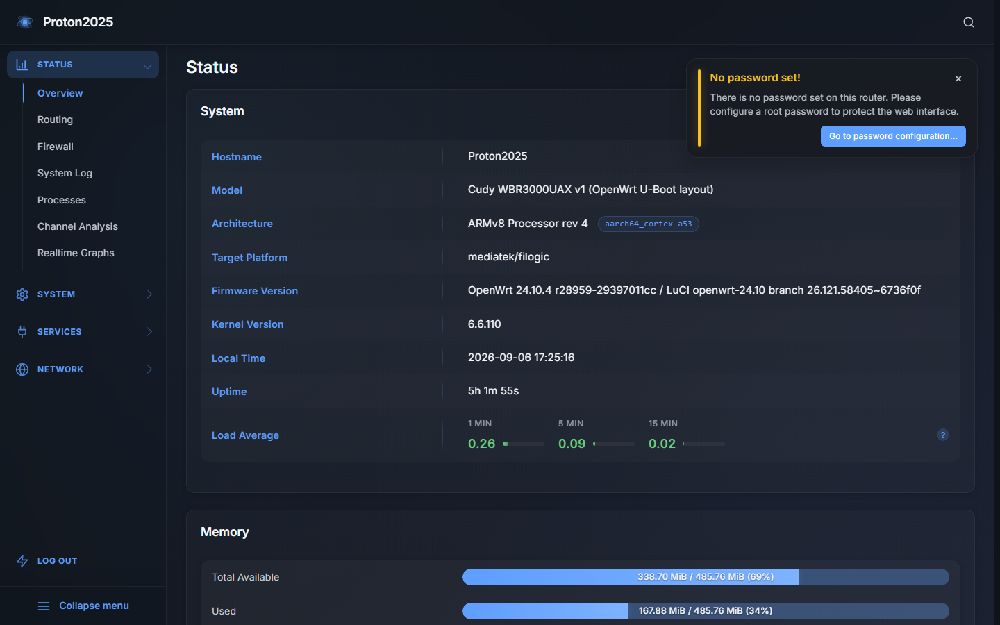
</div>

<details>
<summary>More screenshots</summary>

<div align="center">
  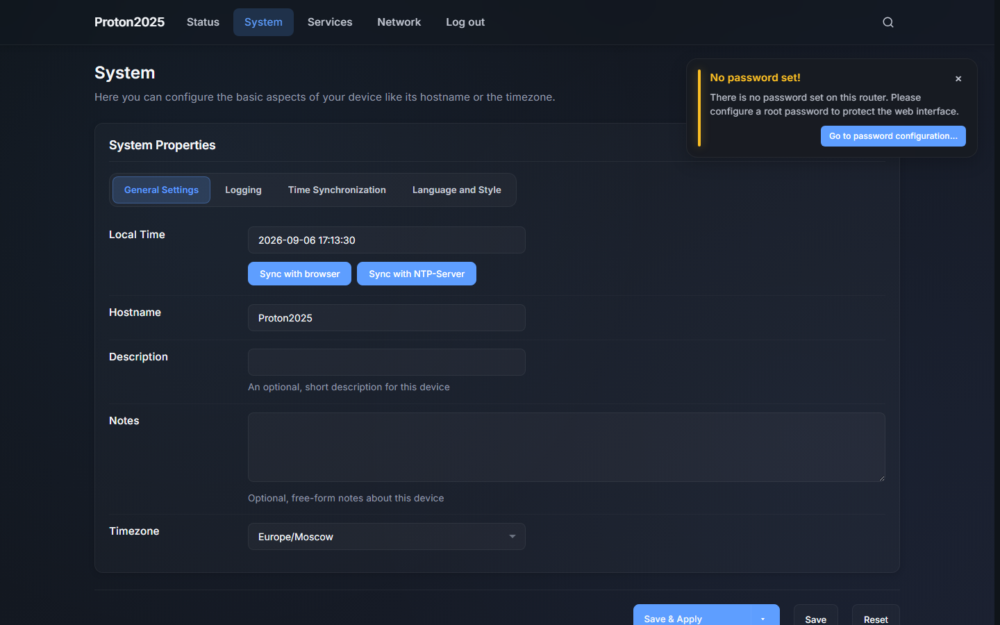
  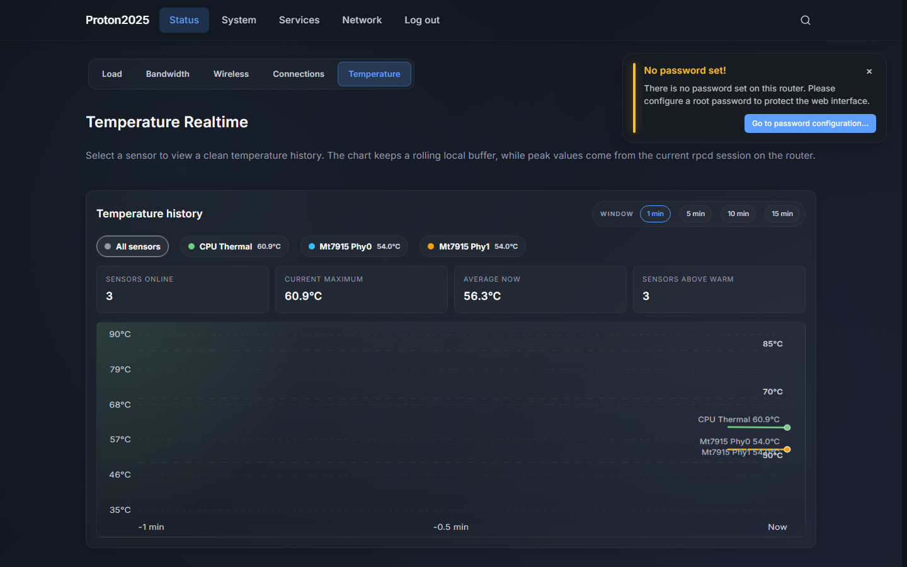
  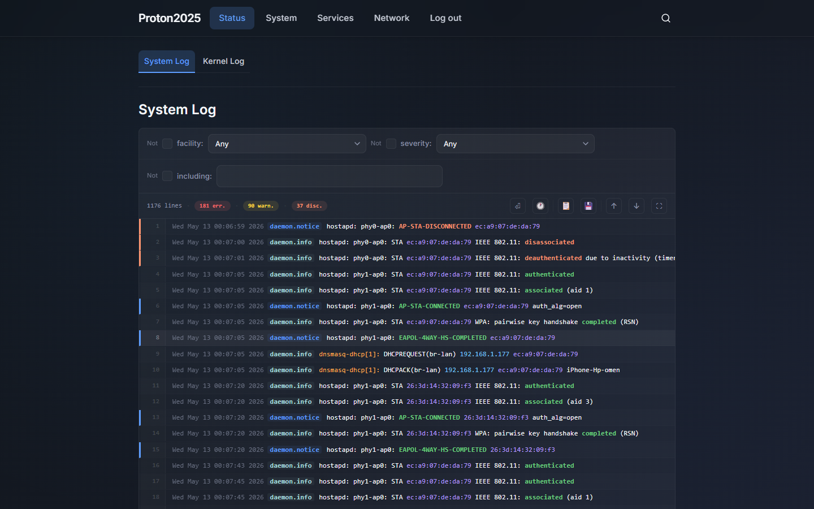
  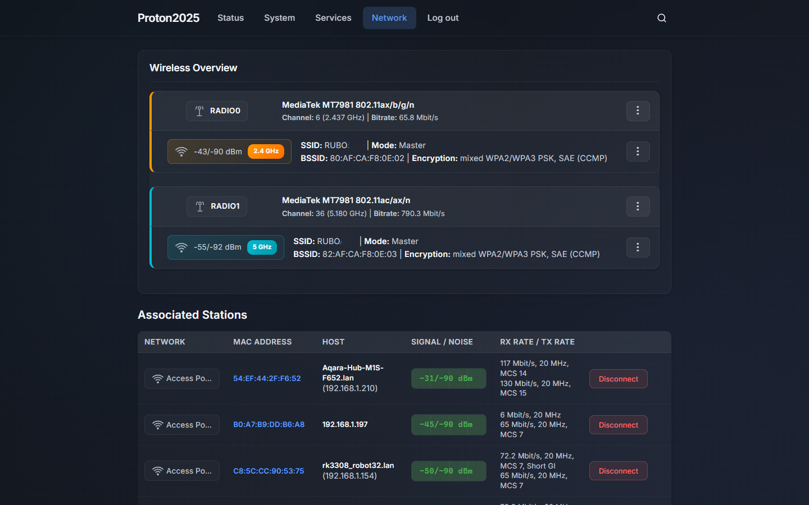
  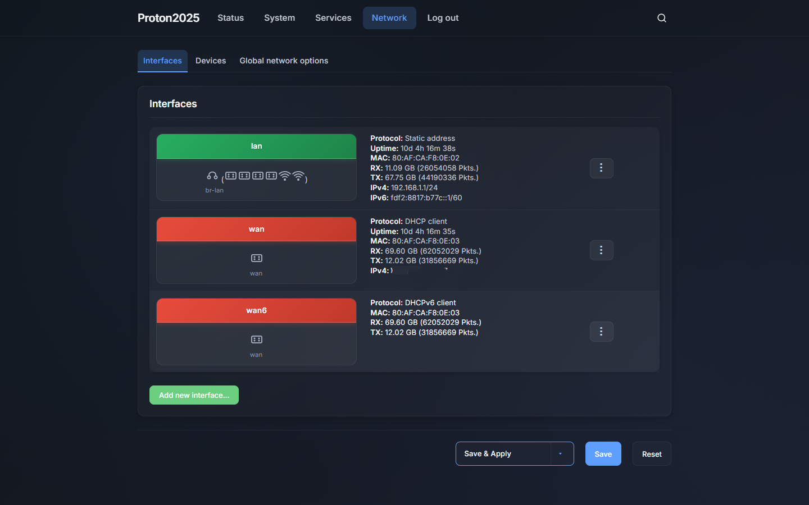
  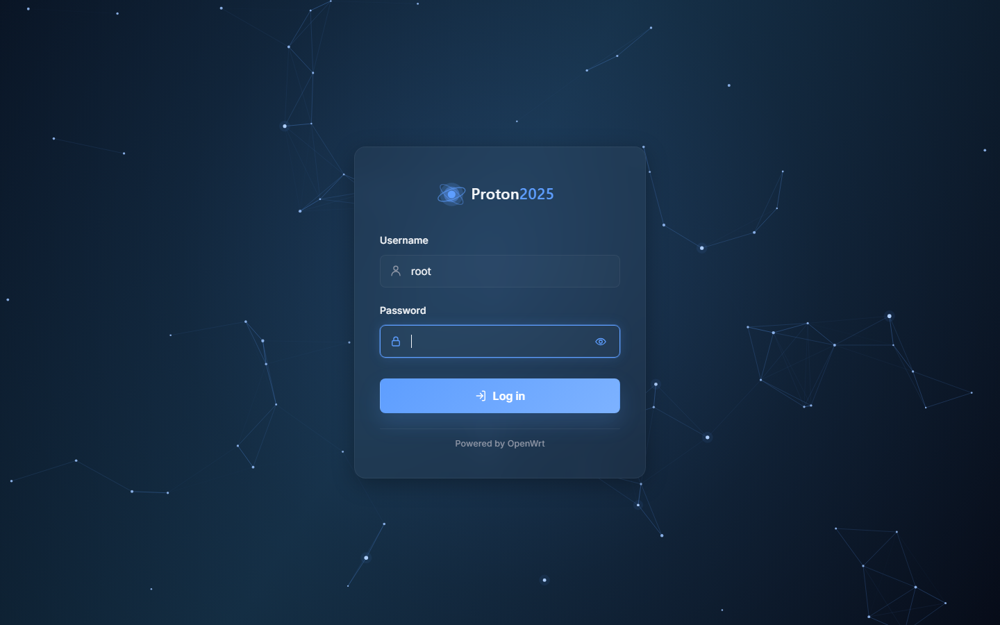
</div>

<div align="center">
  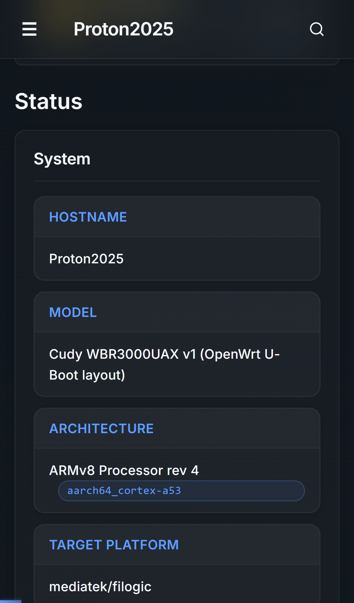
  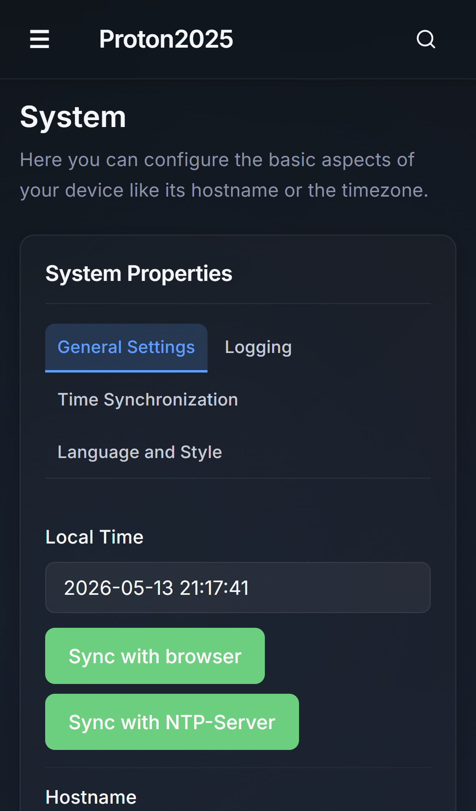
  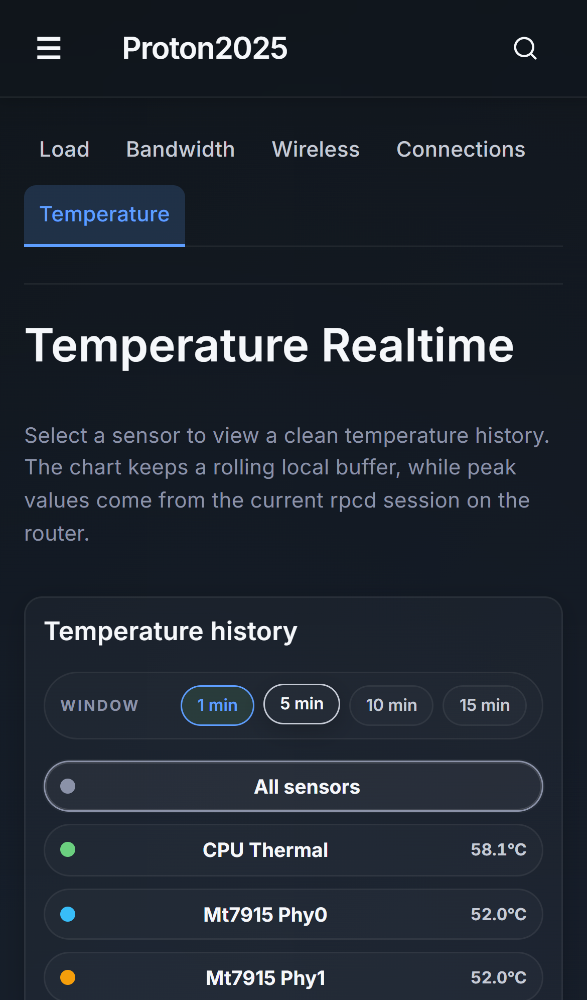
  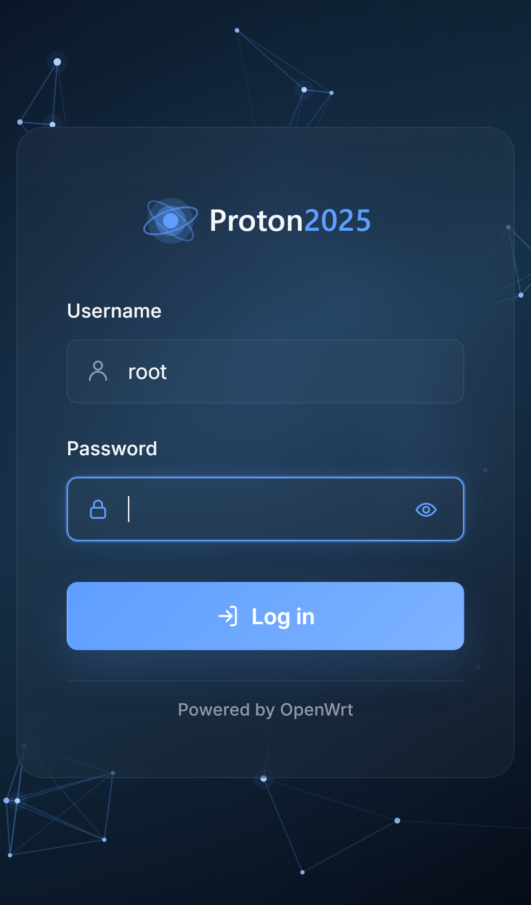
</div>

</details>

## Requirements

- OpenWrt 23.05 or newer with the ucode-based LuCI (`luci-base`)
- The package is architecture-independent, so one build fits every device
- Root SSH access for the commands below

## Installation

One command over root SSH. The script works out the rest itself: which package
manager the build has (`apk` or `opkg`), the current release, the exact asset
name for that format, then installs the package and switches LuCI over to the
theme.

**Theme only:**

```sh
wget -qO- https://raw.githubusercontent.com/ChesterGoodiny/luci-theme-proton2025/main/install.sh | sh
```

**Theme with dashboard widgets:**

```sh
wget -qO- https://raw.githubusercontent.com/ChesterGoodiny/luci-theme-proton2025/main/install.sh | WITH_DASHBOARD=1 sh
```

The widgets on Status → Overview are no longer part of the theme; they are being
split out into a separate package, `luci-app-proton2025-dashboard`. That package
is not published yet, so the second command currently installs the theme only and
tells you so. Once the package is released, the same command will pull it in.

Reload LuCI in the browser afterwards (Ctrl+F5). If you prefer to install the
package by hand, take the exact file name from the
[Releases page](https://github.com/ChesterGoodiny/luci-theme-proton2025/releases) —
`.apk` if `command -v apk` prints a path, `.ipk` otherwise.

## Updating

Re-run the install command, or let the theme update itself from **System →
System → Language and Style → Tools → Check for updates**.

Settings live in `/etc/config/proton2025` and survive an upgrade.

## Removal

```sh
wget -qO- https://raw.githubusercontent.com/ChesterGoodiny/luci-theme-proton2025/main/uninstall.sh | sh
```

Switches LuCI back to the stock theme, removes the package and anything left
behind, and restarts the web server. `/etc/config/proton2025` is kept, so a
later reinstall picks your settings back up.

## Theme settings

**System → System → Language and Style**, in four tabs:

| Tab        | Contains                                                                                                                                                                                                                      |
| ---------- | ----------------------------------------------------------------------------------------------------------------------------------------------------------------------------------------------------------------------------- |
| Appearance | Theme mode (auto / dark / light), accent colour (Neutral, Blue, Purple, Green, Orange or a custom hex value), corner radius, tab outlines, background pattern (none / grid / dots / stars), animations, transparency and blur |
| Layout     | Background pattern scale, interface zoom, page width (50–100%), desktop menu placement (top bar or sidebar)                                                                                                                   |
| Features   | System log highlighting, bundled Inter font, client-side navigation (SPA — experimental, off by default)                                                                                                                      |
| Tools      | Update check and install, search index (build, clear, size, activity log), settings backup and restore, reset to defaults                                                                                                     |

Settings are written twice: to `localStorage`, so they apply without a flash of
unstyled page, and to UCI (`/etc/config/proton2025`), so they follow the router
rather than the browser and are captured by `sysupgrade -b`.

## Search

The top bar carries a search field covering LuCI pages, tabs and individual
settings. It tolerates typos, swaps between RU and LAT keyboard layouts and
transliterates. The page index is built on demand from **Tools → Search index**
and cached on the router.

## Other features

- Status → Realtime → **Temperature** — a theme-provided page reading
  `/sys/class/thermal/` and `/sys/class/hwmon/` through its own ucode RPC
  module, with no external dependencies
- Colour-coded Load Average bars on the status page
- Automatic styling for third-party packages and custom pages
- 10 interface languages: EN, RU, ZH, DE, UK, ES, PT, PL, FR, IT

The service, temperature and throughput widgets on Status → Overview are no
longer part of this theme — they are moving to a separate package,
`luci-app-proton2025-dashboard`, which is not published yet. The theme only
styles them and carries their settings through backup and restore.

## Troubleshooting

**`404 Not Found`, or `opkg`/`apk` reporting a missing file or `no such
package`.** A hand-written URL contained a `*` — `wget` does not expand
wildcards, so the literal `*` reaches GitHub. Use the install command above, or
the exact asset name from the Releases page.

**`API rate limit exceeded`.** 60 unauthenticated GitHub API requests per hour
per IP. The script falls back to the releases feed, which is not rate limited;
otherwise wait or download the file manually.

**`SSL certificate verification failed` / `wget: bad address`.** The router has
no CA bundle yet:

```sh
opkg update && opkg install ca-bundle ca-certificates
```

```sh
apk update && apk add ca-bundle ca-certificates
```

**The old style or old icons still show after an update.** Browser cache.
Hard-reload with Ctrl+F5 (Cmd+Shift+R on macOS).

**LuCI still renders the stock theme.** Check what LuCI points at and that the
files landed:

```sh
uci get luci.main.mediaurlbase   # expected: /luci-static/proton2025
ls -l /www/luci-static/proton2025
logread | grep -i uhttpd
```

If the path is wrong, set it and restart the web server:

```sh
uci set luci.main.mediaurlbase=/luci-static/proton2025
uci commit luci
/etc/init.d/uhttpd restart
```

**`/bin/sh^M: bad interpreter`.** A script saved with Windows CRLF line endings.
Fix it in place:

```sh
sed -i 's/\r$//' install.sh
```

**`apk` refuses the package.** Only packages produced by the OpenWrt
SDK/buildroot are valid; a `tar.gz` renamed to `.apk` will never install.
Releases before 1.1.2 contained such repacked files.

**Checking what is installed:**

```sh
opkg list-installed | grep -i proton2025
```

```sh
apk info -e luci-theme-proton2025
```

## Building from source

```sh
cd ~/openwrt
git clone https://github.com/ChesterGoodiny/luci-theme-proton2025 package/luci-theme-proton2025
./scripts/feeds update -a && ./scripts/feeds install -a
make menuconfig   # LuCI -> Themes -> luci-theme-proton2025
make package/luci-theme-proton2025/compile V=s
```

The package lands in `bin/packages/*/` — as `.ipk` with an opkg-based SDK, or as
`.apk` with an apk-based SDK (`CONFIG_USE_APK=y`).

## Project layout

```
htdocs/luci-static/proton2025/     # theme assets: css/, js/, i18n/, img/, icons/, fonts/
htdocs/luci-static/resources/      # LuCI-side modules: menu, dropdowns, search index,
                                   # theme settings, SPA router,
                                   # view/status/proton-temperature.js
ucode/template/themes/proton2025/  # header.ut, footer.ut, sysauth.ut
root/etc/config/proton2025         # UCI settings (a conffile — kept on upgrade)
root/usr/share/luci/menu.d/        # menu entry for the Temperature page
root/usr/share/rpcd/ucode/         # RPC: proton-search-cache, proton-settings,
                                   # proton-system, proton-temp
install.sh / uninstall.sh          # one-command install and removal
```

## License

Apache-2.0. Copyright 2025-2026 ChesterGoodiny. Project icons and bundled SVG
assets are original first-party assets covered by Apache-2.0. See LICENSE and
NOTICE for attribution details.

Third-party assets: the **Inter** font, Copyright 2020 The Inter Project Authors
(https://github.com/rsms/inter), under SIL Open Font License 1.1 — license file
at `htdocs/luci-static/proton2025/fonts/LICENSE.txt`.

## Acknowledgements

- The optional SPA (same-document navigation) mode borrows some of its ideas
  from [luci-theme-footstrap](https://github.com/VizzleTF/luci-theme-footstrap),
  which pioneered client-side navigation for LuCI themes. The idea to bring this
  approach into this theme came from seeing it adopted by the Aurora and Shadcn
  themes (eamonxg). proton2025's router is an independent implementation built on
  the browser Navigation API.
- The alias/firstchild resolution logic is ported from LuCI's own
  `dispatcher.uc` (luci-base, Apache-2.0), so that a clicked link and a page
  reload resolve to exactly the same view.
- Thanks to [lastik9/openwrt-luci-theme-proton2025](https://github.com/lastik9/openwrt-luci-theme-proton2025)
  for helping identify the installation documentation issues that prompted this
  simpler installer flow.

## Star history

<a href="https://www.star-history.com/?repos=ChesterGoodiny%2Fluci-theme-proton2025&type=date&legend=top-left">
 <picture>
   <source media="(prefers-color-scheme: dark)" srcset="https://api.star-history.com/chart?repos=ChesterGoodiny/luci-theme-proton2025&type=date&theme=dark&legend=top-left" />
   <source media="(prefers-color-scheme: light)" srcset="https://api.star-history.com/chart?repos=ChesterGoodiny/luci-theme-proton2025&type=date&legend=top-left" />
   
 </picture>
</a>
